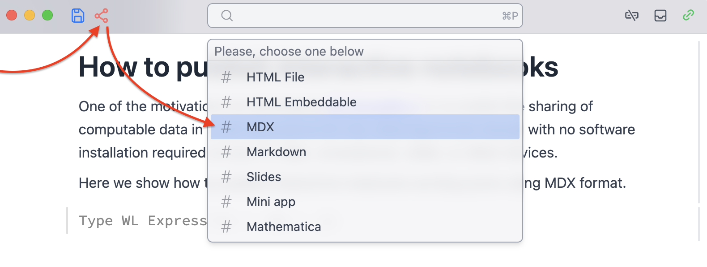

{/* add this script to the body  */}
{/* https://cdn.jsdelivr.net/gh/WLJSTeam/web-components@latest/src/common/app.js */}
<wljs-store kernel="./attachments/kernel-8303857793246943890.txt" json="./attachments/dca35281-3646-4107-8f60-4608011f9703.txt"></wljs-store>


# How to publish interactive notebooks

One of the motivations for developing [WLJS platform](https://wljs.io) is to enable the sharing of computable data in a self-descriptive format, allowing it to be viewed with no software installation required on any PC, Mac, smartphone, tablet, or other devices.

Here we show how to publish interactive notebooks as blog posts using MDX format:


<wljs-html encoded="true">{`%3Cbr%20%2F%3E`}</wljs-html>

Then you choose `/contents/posts/youPost/index.mdx`

The exported data is still editable and human-readable, since we rely on a native web-components:

```html
## Features
Let's go briefly though what can be automatically exported

__Basic plots__

<wljs-editor display="codemirror" type="Input"  >{`Plot[1/x, {x,0,1}]`}</wljs-editor>
...

```

## Features
Let's go briefly though what can be automatically exported

__Basic plots__

<wljs-editor display="codemirror" type="Input"  >{`Plot[(*FB[*)((1)(*,*)/(*,*)(x))(*]FB*), {x,0,1}]`}</wljs-editor>

<wljs-editor display="codemirror" type="Output"  >{`(*VB[*)(FrontEndRef["4aec892f-4d60-4487-873c-13601449ddd6"])(*,*)(*"1:eJxTTMoPSmNkYGAoZgESHvk5KRCeEJBwK8rPK3HNS3GtSE0uLUlMykkNVgEKmySmJltYGqXpmqSYGeiamFiY61qYGyfrGhqbGRiamFimpKSYAQB+MxUh"*)(*]VB*)`}</wljs-editor>

<wljs-editor display="codemirror" type="Input"  >{`BarChart[{{1, 2, 3}, {1, 3, 2}, {5, 2}}, 
 ChartLegends -> {"a", "b", "c"}]`}</wljs-editor>

<wljs-editor display="codemirror" type="Output"  >{`(*VB[*)(Legended[ToExpression[FrontEndRef["9a346519-d51b-4c80-8925-55298a738d1f"], InputForm], Placed[SwatchLegend[{Directive[EdgeForm[Directive[Thickness[Small], Opacity[0.644], GrayLevel[0]]], RGBColor[1., 0.78, 0.2]], Directive[EdgeForm[Directive[Thickness[Small], Opacity[0.644], GrayLevel[0]]], RGBColor[0.784, 0.4752, 0.2]], Directive[EdgeForm[Directive[Thickness[Small], Opacity[0.644], GrayLevel[0]]], RGBColor[0.49920000000000003, 0.5552, 0.8309304]]}, {"a", "b", "c"}, LegendMarkers -> {{None}, {Automatic, Automatic, Automatic}}, LabelStyle -> {{}, {}}, LegendLayout -> "Column"], After, Identity]])(*,*)(*"1:eJzVUztLHFEUHleND9bGIn3AQpAFd3WS3WrwsYoyRnEkEkhz584ZvXh3bjxzR51fIFhoJyTWYhr/hNpok38QES1imoSApkiT+4CYlWCtt/i45/2dwzkvQjEftzqOk/YoeMNgfRyoQCIFBh1K48MSJFElLmiXbgX1iCmbdoxbtK5XwQSKRNaTqL4BNJMk5BD0KXWNDA2/dMu1UuSWw9IwrQ6WqrWKW3LdSq1KXg1Vo3JsE7cpmM9UWKf+AIlmE54b7QJmYPk9UzDHCYUobtdyUUGwTiRdthytl47xWSpt3i4F4wyBSrYGlm+n6WEJJgQ2bMh/nLRqYZnRlQTSNNXlggbh3Br1WGbfE8pkjp9/BZf7e1feXdgkktyHNeBMCY6tYLqaHB0TXCA65v3w8Lb/3c7RzVcPP37Q79R7vJyni4WBzefXHn4/PR49ZF+eAufz1a3tq5/nHm4eLJ5VTi48LPR+evt795vXvCmBTkkMhgZp806aw7ArNkNwBTC9s5tNa/lXMp/XIoHmIobySCZFg0hGH5LuFdcn55MQeCBzDvcqOw9IzWmKf3vwSS4yGehrUnPKGokZ+0gsVWN6flMRJFKN/A/SIQ+k"*)(*]VB*)`}</wljs-editor>

:::tip
This is not a picture. Try to zoom or pan*
:::

__Contour and parameteric plots__

<wljs-editor display="codemirror" type="Input" fade="true" >{`ParametricPlot[
    With[{z = u + I v},
        {Re[z + (*FB[*)((1)(*,*)/(*,*)(z))(*]FB*)], Im[z + (*FB[*)((1)(*,*)/(*,*)(z))(*]FB*)]}
    ]
    ,
    {u, -(*FB[*)((1)(*,*)/(*,*)(2))(*]FB*), (*FB[*)((1)(*,*)/(*,*)(2))(*]FB*)}
    ,
    {v, -(*FB[*)((1)(*,*)/(*,*)(2))(*]FB*), (*FB[*)((1)(*,*)/(*,*)(2))(*]FB*)}
    ,
    PlotRange -> 5
    ,
    Mesh -> Automatic
]`}</wljs-editor>

<wljs-editor display="codemirror" type="Output"  >{`(*VB[*)(FrontEndRef["abde8398-d769-4b5e-b9ab-e0e28564f0ff"])(*,*)(*"1:eJxTTMoPSmNkYGAoZgESHvk5KRCeEJBwK8rPK3HNS3GtSE0uLUlMykkNVgEKJyalpFoYW1roppibWeqaJJmm6iZZJibpphqkGlmYmpmkGaSlAQCRjRZI"*)(*]VB*)`}</wljs-editor>

__Stream plots__

<wljs-editor display="codemirror" type="Input"  >{`StreamPlot[{-1 - (*SpB[*)Power[x(*|*),(*|*)2](*]SpB*) + y, 1 + x - (*SpB[*)Power[y(*|*),(*|*)2](*]SpB*)}, {x, -3, 3}, {y, -3, 3}, StreamScale->Large]`}</wljs-editor>

<wljs-editor display="codemirror" type="Output"  >{`(*VB[*)(FrontEndRef["c13684f4-f310-43c8-a0ca-fdde17e05ae8"])(*,*)(*"1:eJxTTMoPSmNkYGAoZgESHvk5KRCeEJBwK8rPK3HNS3GtSE0uLUlMykkNVgEKJxsam1mYpJnophkbGuiaGCdb6CYaJCfqpqWkpBqapxqYJqZaAACCVBX6"*)(*]VB*)`}</wljs-editor>

__Any 3D graphics__

<wljs-editor display="codemirror" type="Input"  >{`Plot3D[Sin[(*SqB[*)Sqrt[(*SpB[*)Power[x(*|*),(*|*)2](*]SpB*)+(*SpB[*)Power[y(*|*),(*|*)2](*]SpB*)](*]SqB*)], {x, -6, 6}, {y, -6, 6}, PlotRange -> All, Mesh -> None, ColorFunction -> "Rainbow"]`}</wljs-editor>

<wljs-editor display="codemirror" type="Output"  >{`(*VB[*)(FrontEndRef["00658a08-b0c2-42df-9583-24ac84e82d55"])(*,*)(*"1:eJxTTMoPSmNkYGAoZgESHvk5KRCeEJBwK8rPK3HNS3GtSE0uLUlMykkNVgEKGxiYmVokGljoJhkkG+maGKWk6VqaWhjrGpkkJluYpFoYpZiaAgB2chUS"*)(*]VB*)`}</wljs-editor>

__Manipulate__

<wljs-editor display="codemirror" type="Input"  >{`Manipulate[Plot[1.0 + Sin[w] Sin[x + w],{x,0,5Pi}, Epilog->{
  Red, PointSize[0.1], Point[{8.0, 1.0 + Sin[w] Sin[8.0 + w]}]
}], {w,0,Pi}, ContinuousAction->True]`}</wljs-editor>

<wljs-editor display="codemirror" type="Output"  >{`(*VB[*)(FrontEndRef["f05602eb-2a57-47d2-a92a-8431b7d5ef1b"])(*,*)(*"1:eJxTTMoPSmNkYGAoZgESHvk5KRCeEJBwK8rPK3HNS3GtSE0uLUlMykkNVgEKpxmYmhkYpSbpGiWamuuamKcY6SZaGiXqWpgYGyaZp5imphkmAQB+1BWa"*)(*]VB*)`}</wljs-editor>

__Many more__

Slides of your presentation, equations, mermaid diagrams, code insets, anything which is displable in WLJS Notebook application can be viewed on this page too! 